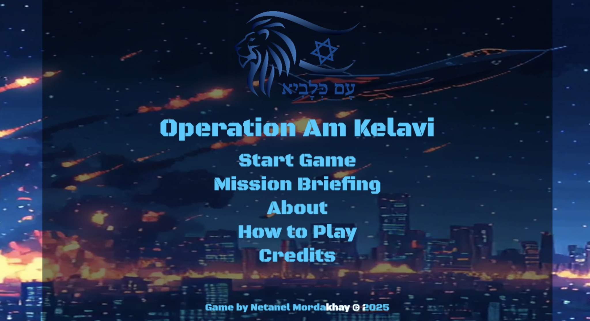
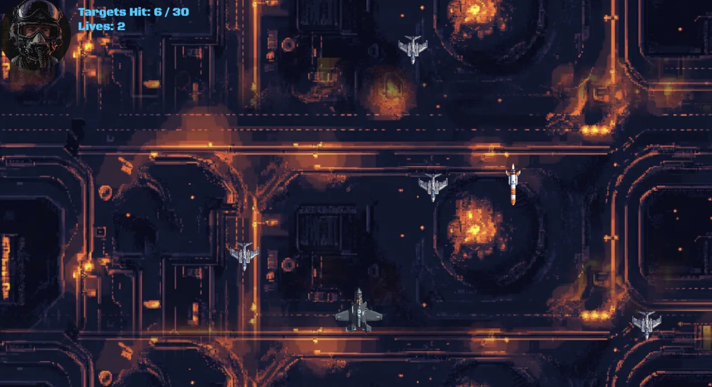
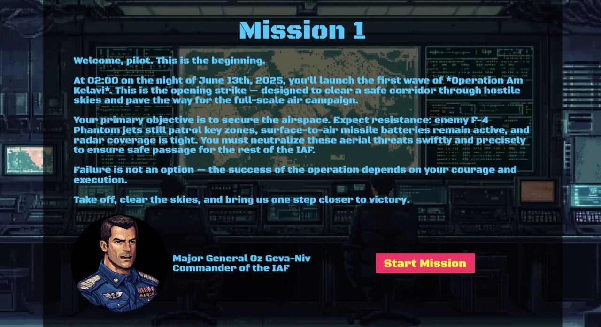

# Operation Am Kelavi

**Operation Am Kelavi** is a 2D web-based arcade game inspired by the Israel-Iran war events, built with [Phaser 3](https://phaser.io/). You play as an F-35 pilot flying deep into enemy territory, completing missions, intercepting threats, and defending your nation.

## Play the Game

👉 [Click here to play](https://am-kelavi.naticodes.com)

- Desktop & mobile support

---

## Features

- Mission-based gameplay with interactive briefings and voiceovers
- Missile interception, UAV hunting, air-to-air combat, boss fight
- Immersive soundtrack and background video

---

## How to Play

#### PC CONTROLS:

- ← → Move Left / Right
- ↑ ↓ Move Up / Down
- SPACE Fire missiles

#### MOBILE CONTROLS:

- Swipe left/right to move
- Swipe up/down to move
- Shoots automatically

---

## Tech Stack

- **Framework:** Phaser 3 (WebGL / Canvas)
- **Language:** JavaScript
- **Assets:** Custom voiceovers (ttsmp3.com), background video, and pixel-style sprites (Midjourney), soundtrack (Suno AI)
- **UI/UX:** Dynamic menus with modals, glowing text, and responsive design
